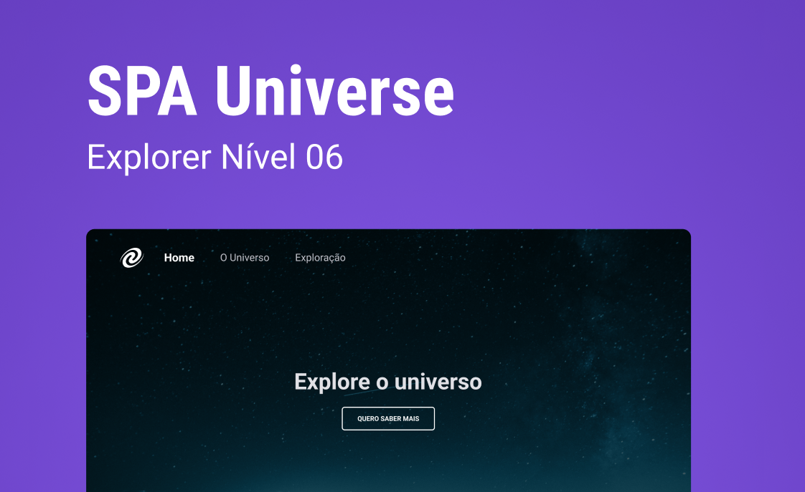

 

<h1 align="center">
    <a href="#"> SPA Universe </a>
</h1>

<p align="center">
	
  
	
  
	
  

  
</p>


<h4 align="center"> 
	 Status: Finished
</h4>

<p align="center">
 <a href="#-about">About</a> •
 <a href="#-Features">Features</a> •
 <a href="#-layout">Layout</a> • 
 <a href="#-tech-stack">Tech Stack</a> • 
 <a href="#-author">Author</a> • 
 <a href="#-license">License</a>

</p>

## 💻 About

Spa Universe is a project made to consolidate the learnings about:

- SPA concepts;
- Route mapping;
- Asynchronous and promises;
- Object orientation;
- Classes and more.

---

### Web

<p align="center" style="display: flex; align-items: flex-start; justify-content: center;">
  

</p>

---


## 🚀 How it works

Pre-requisites
Before you begin, you will need to have the following tools installed on your machine: [Git] (https://git-scm.com), [Node.js] (https://nodejs.org/en/). In addition, it is good to have an editor to work with the code like [VSCode] (https://code.visualstudio.com/)

#### 🎲 Running the web application (Frontend)

```bash
# Clone this repository
$ git clone git@github.com: exodogurgel / SpaUniverse.git

# Access the project folder in your terminal
$ cd SpaUniverse

# Install the dependencies
$ npm install

# Run the application in development mode
$ npm run start

# The application will open on the port: 3000 - go to http://localhost:3000
```
---

## 🛠 Tech Stack

The following tools were used in the construction of the project:


#### **Project** 

-   HTML
-   CSS
-   Javascript
-   Ecmascript modules


---
## 🦸 Author

<a href="https://blog.rocketseat.com.br/author/exodo/">
  
 <br />
 <sub><b>Êxodo Gurgel</b></sub></a> <a href="https://blog.rocketseat.com.br/author/exodo/" title="Rocketseat"></a> 🚀
 <br />

[](https://www.linkedin.com/in/exodo-gurgel/) 
[](mailto:exodowellis@gmail.com)

---

## 📝 License

This project is under the license [MIT](./LICENSE).

Made with ❤️ by Êxodo Gurgel 👋🏽 [Get in Touch!](Https://www.linkedin.com/in/exodo-gurgel/)

---
